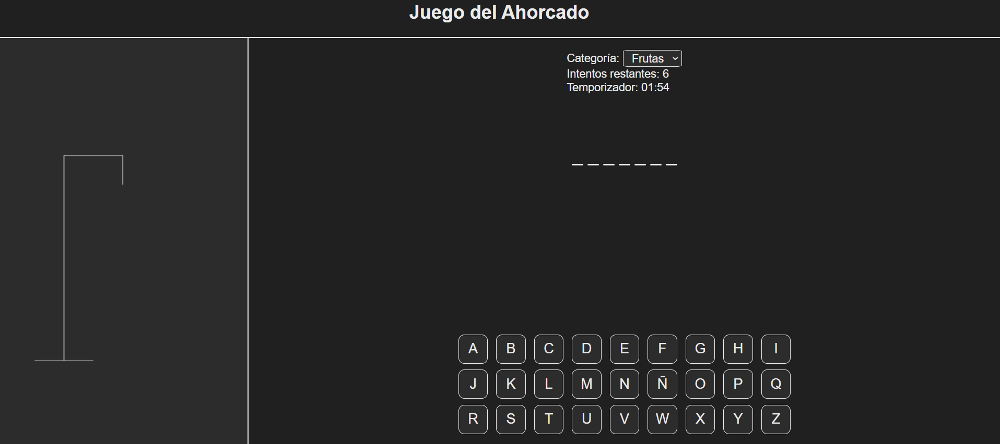
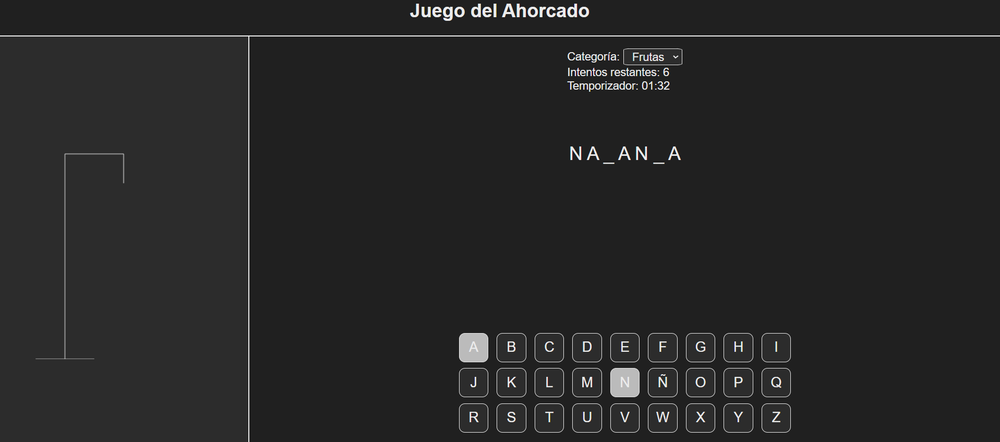
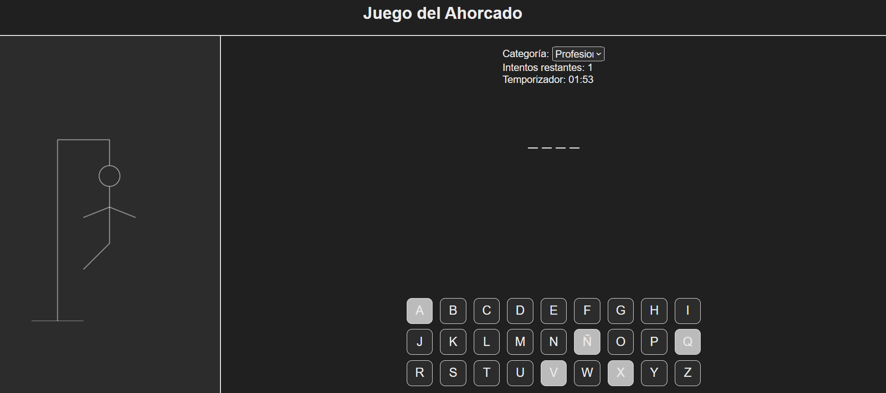
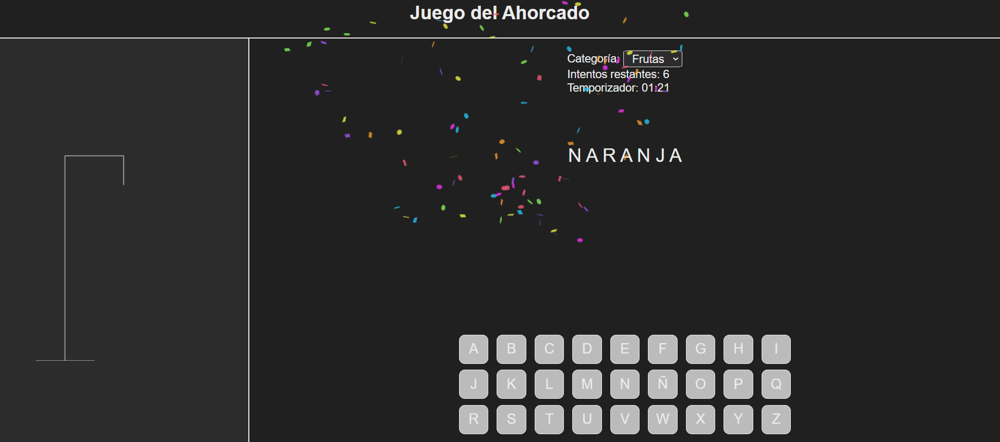

# Juego del Ahorcado

¡Bienvenido al **Juego del Ahorcado**! Este es un juego interactivo donde puedes elegir entre varias categorías para adivinar palabras antes de que se te acaben los intentos. Cada vez que fallas, se va dibujando un ahorcado en el **canvas**. Tienes un límite de **5 intentos** para adivinar la palabra y **2 minutos** para ganar. Si adivinas la palabra correctamente, ¡se celebrará con confeti!

## Características

- **Categorías de Palabras**: Puedes escoger entre las siguientes categorías:
  - Profesiones
  - Frutas
  - Países
  - Animales
  - Colores
  - Deportes
  - Ciudades
  - Comidas
- **Canvas Dinámico**: A medida que fallas, el dibujo del ahorcado se va completando en un canvas, dándote una representación visual de tus errores.

- **Tiempo Límite**: Tienes **2 minutos** para adivinar la palabra y **5 intentos** de fallos antes de perder el juego.

- **Confeti**: Si adivinas la palabra correctamente, ¡celebra con confeti!

## Cómo Jugar

1. **Selecciona una Categoría**: En el inicio, podrás escoger una de las categorías mencionadas.
2. **Adivina las Letras**: Verás guiones que representan las letras de la palabra. Usa los botones para seleccionar letras.
3. **Canvas del Ahorcado**: Cada vez que falles una letra, el ahorcado se dibuja más, hasta llegar al límite de 5 fallos.
4. **Tiempo Límite**: Tienes 2 minutos para adivinar la palabra. Si el tiempo se agota, perderás automáticamente.

5. **Victoria o Derrota**: Si adivinas la palabra antes de que se acaben los intentos o el tiempo, ¡ganas! Si no, pierdes y el ahorcado es completado.

## Imágenes del Juego

A continuación, se presentan algunas imágenes del juego:

### Pantalla de Inicio

En la pantalla de inicio puedes ver las opciones para elegir la categoría.

### Jugando

Una vez que empieces a jugar, se mostrará el estado de la palabra, los intentos restantes y el dibujo del ahorcado en el canvas.

### Si pierdes

Cuando te quedas sin intentos, el juego te muestra el ahorcado completo y pierdes.

### Si ganas

Si adivinas la palabra, el juego te celebrará con confeti.

## Tecnologías Usadas

- **Node.js**: Para la lógica del backend y la gestión del juego.
- **HTML/CSS**: Para la estructura y el diseño de la interfaz de usuario.
- **Canvas**: Para mostrar el dibujo del ahorcado que se va completando a medida que fallas.
- **JavaScript**: Para manejar las interacciones y la lógica del juego.

### ¡Diviertete Jugando!
